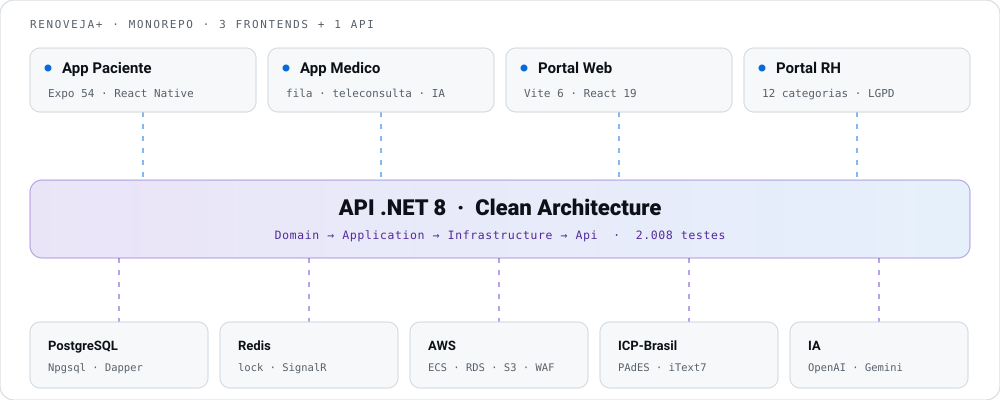

<div align="center">

<picture>
  <source media="(prefers-color-scheme: dark)" srcset="assets/banner-dark.svg">
  <source media="(prefers-color-scheme: light)" srcset="assets/banner-light.svg">
  
</picture>

<br>

[](https://linkedin.com/in/felipe-menezes2000)
[](mailto:felipemenezes.contato@gmail.com)
[](https://busca.inpi.gov.br/pePI/)

</div>

---

> **De dia** eu mantenho de pé a operação crítica de um dos maiores bancos da América Latina.
> **De noite** eu escrevo a plataforma de telessaúde que uma prefeitura contrata para atender o cidadão de graça.
>
> É o mesmo problema dos dois lados: **sistemas que não podem cair — e que, quando caem, machucam gente de verdade.**

<br>

<picture>
  <source media="(prefers-color-scheme: dark)" srcset="assets/metrics-dark.svg">
  <source media="(prefers-color-scheme: light)" srcset="assets/metrics-light.svg">
  
</picture>

<sub>Todo número deste perfil foi <b>medido em 23/08/2026</b>, não estimado. As suítes foram executadas, não contadas por grep.</sub>

---

## A regra da casa

<picture>
  <source media="(prefers-color-scheme: dark)" srcset="assets/pipeline-dark.svg">
  <source media="(prefers-color-scheme: light)" srcset="assets/pipeline-light.svg">
  
</picture>

Essa escada está versionada no repositório da plataforma e vale para README, proposta comercial, due diligence e conversa de corredor. **Nenhum degrau vale pelo seguinte.** Teste verde não é servidor de pé. Servidor de pé não é produção. Produção não é homologação do órgão.

É por isso que este perfil é mais conservador do que poderia ser: eu prefiro um número menor que aguenta auditoria a um número maior que morre na primeira pergunta.

---

## RenoveJá+ — telessaúde para o setor público

Plataforma de **renovação de receitas, solicitação de exames, teleconsulta e prontuário**, com canais separados para paciente, médico, profissional de UBS, gestor municipal e fiscalização/TCE.

**Como o dinheiro funciona:** o acesso do cidadão é gratuito — o app não tem tela de pagamento, não há gateway no código nem dependência de pagamento em nenhum manifest. Quem custeia é o **ente público contratante**, pelo rito de contratação pública (licitação ou credenciamento, Lei 14.133/2021), com SLA aferível, produção nominal por competência (CNS, CBO, código SIGTAP), faturamento com glosa e trilha de evidência para os órgãos de controle. O backend implementa esse modelo de ponta a ponta.

**Propriedade intelectual:** existe **pedido de patente depositado no INPI sob o nº BR 10 2026 008006 3, em 01/04/2026**, sobre o fluxo de renovação digital de receitas — em tramitação. Não concedido. O número é conferível na base pública do órgão em trinta segundos, e é exatamente por isso que ele está aqui.

<picture>
  <source media="(prefers-color-scheme: dark)" srcset="assets/arch-dark.svg">
  <source media="(prefers-color-scheme: light)" srcset="assets/arch-light.svg">
  
</picture>

---

## Os problemas difíceis (e o que eu fiz com eles)

Badge de linguagem qualquer um cola no perfil. Isto aqui é o que deu trabalho de verdade:

| O problema | O que eu fiz |
| :--- | :--- |
| **Assinar 40 receitas de uma vez travava a UI** — e com duas tasks no Fargate, duas instâncias podiam assinar o mesmo documento. | Job assíncrono que sobrevive ao request HTTP: `202` e o lote segue em background, com progresso por item. **Dois níveis de lock distribuído em Redis** (`SET NX EX` com fencing token em Lua, TTL renovado a cada item) serializam o lote por médico. Perder o lock no meio **cancela** o lote em vez de arriscar assinatura duplicada, e item já assinado é pulado. O app degrada em três camadas: SignalR → polling de 2 s → watchdog de 45 s. **63 testes** só nesse fluxo. |
| **Um PDF de receita é trivial de editar** no Acrobat. | Assinatura com **certificado ICP-Brasil A1 do próprio médico** (a plataforma não tem PFX próprio). O CMS é montado à mão com os **4 OIDs do ITI** para documentos de saúde — prescrição, exame, CRM e UF —, `signingCertificateV2` e a política ICP-Brasil AD-RB v1.3, **cujo hash é recalculado a partir do DER oficial e conferido antes de assinar**. Faltando as âncoras oficiais no ambiente, o serviço **se recusa a assinar**. O PDF sai com DocMDP P=2 e QR Code para um endpoint que fala o protocolo do Validador ITI. |
| **Receita controlada reusada** em várias farmácias. | Validade calculada na emissão por tipo — simples 6 meses, controle especial 30 dias, antimicrobiana 10 dias (RDC 471/2021) —, `max_dispenses = 1`, registro de farmácia/farmacêutico/CRF e bloqueio de reuso por **UPDATE condicional atômico** (`WHERE dispensed_at IS NULL`), com o PDF bloqueado depois da dispensação. |
| **IA alucinando prescrição** — o risco que mata o produto e o paciente. | A IA nunca emite nada: **todo documento clínico sai assinado pelo médico**, e cada sugestão deixa trilha em `ai_suggestions` com o modelo efetivamente usado, quem confirmou e o hash do conteúdo aceito. Antes do LLM, o `PromptSanitizer` redige **6 tipos de PII** e detecta prompt injection em pt/en; depois, o `SafetyRefusalDetector` classifica recusa, truncamento e resposta vazia, troca de provedor e cai num fallback honesto em vez de culpar a foto do paciente. **128 testes** de IA. |
| **Integração com o SUS que finge ter dado certo.** | **Outbox transacional** com `FOR UPDATE SKIP LOCKED` — vários pods reivindicando sem selecionar o mesmo evento —, retry com backoff, dead-letter e claim abandonado que volta para a fila. Faltando credencial, mapper, serializer ou homologação, o evento vira **`blocked_prerequisite`**, nunca falso sucesso. Adapters read-only reais de **SOA-CNES** e **SOA-SIGTAP**; RNDS e e-SUS APS com transporte implementado e fail-closed. |
| **Paciente que não consegue digitar** o nome do próprio remédio. | Preenchimento por voz ligado em telas reais: áudio por `expo-av`, transcrição no backend próprio, polimento clínico opcional. Antes de qualquer ida ao LLM, uma triagem **determinística, rodando no aparelho** — **101 padrões em 12 regras** — separa risco suicida de emergência clínica, curto-circuita a conversa e abre um overlay bloqueante com **CVV 188** e **SAMU 192**. Mais alto contraste, 3 escalas de fonte, 4 modos de visão de cores e 504 `accessibilityLabel`. |
| **Deriva visual entre 3 frontends** feitos em stacks diferentes. | `tokens.json` (299 tokens) gera, por um único script, o TS do app Expo e o CSS dos portais — com teste que reprova o commit se o gerado sair de sincronia. O gerador **valida 132 pares de contraste WCAG antes de emitir arquivo**: um par reprovado derruba o build. Um `design-lint` de 11 regras mede a dívida herdada contra baseline por app, e o portão falha quando a contagem **sobe**. No web, `axe-core` sobre Playwright: 15 checagens em 7 rotas, zero regra desabilitada, zero violação tolerada. |
| **Isolar dados clínicos entre municípios.** | Hoje o isolamento é **uma camada**: filtro por instituição na aplicação. A segunda — **49 policies de RLS**, funções de contexto de sessão, papéis e preflight de ativação — está escrita, versionada e testada contra um Postgres descartável, **mas o enforcement não está ligado**: nenhuma tabela tem `ENABLE`, e a aplicação conecta como dona das tabelas (exigiria `FORCE`). Ligar sem as pré-condições seria decorativo ou derrubaria fluxo legítimo. Isso está no runbook — e está aqui — em vez de virar uma linha de marketing. |

---

## O tamanho da coisa

| | |
| :--- | :--- |
| **Código** | **384.099 linhas** em 1.889 arquivos — backend C#, web e mobile TS/TSX (319.403 descontando brancos e comentários) |
| **API** | **536 endpoints** declarados na `main`, em 132 classes de controller — *317 no código que está no ar; o deploy está 1.032 commits atrás* |
| **Banco** | 73 grupos de migration no runner de startup + 69 arquivos SQL versionados |
| **Telas** | 65 no app (expo-router) e 112 rotas web distintas, em 6 portais |
| **Testes** | **6.533**, dos quais **151 de integração contra um PostgreSQL 15 de verdade** — sem banco, eles falham de propósito |
| **Ritmo** | **3.026 commits** na `main` em 190 dias, 3 autores humanos |

<picture>
  <source media="(prefers-color-scheme: dark)" srcset="assets/stack-dark.svg">
  <source media="(prefers-color-scheme: light)" srcset="assets/stack-light.svg">
  
</picture>

---

## O que eu **não** digo

A parte mais difícil de um perfil técnico não é o que entra. É o que você tira depois de conferir.

- **Não digo "temos patente".** Existe *pedido* — BR 10 2026 008006 3, depositado em 01/04/2026, em tramitação. Depósito não confere exclusividade.
- **Não digo que a plataforma é gratuita.** Gratuito é o acesso do cidadão. A plataforma é contratada e paga pelo poder público.
- **Não digo "PAdES".** O CMS carrega os OIDs do ITI e a política ICP-Brasil, mas o dicionário de assinatura ainda não grava `/SubFilter /ETSI.CAdES.detached`. Enquanto não gravar, a palavra não é minha.
- **Não digo "validado pelo ITI".** O código implementa o protocolo do validador; nenhum PDF gerado por ele foi submetido ainda.
- **Não digo "RLS ativo".** As policies existem. O enforcement, não.
- **Não digo "todos os testes verdes".** São 6.533 testes e, em 23/08/2026, **6.532 passam e 1 falha** — um teste de outbox com incompatibilidade `text`/`jsonb`. Está aqui porque eu prefiro contar antes de perguntarem.

---

## SRE — o outro turno

Gestão de incidentes críticos P1/P2 no **BTG Pactual**, com automação em Python, n8n e Datadog.

| | Antes | Depois |
| :--- | :---: | :---: |
| **MTTR** | baseline | **−60%** |
| **Tempo de triagem** | manual | **−75%** |
| **Tickets processados** | ~200/mês | **1.000+/mês** *(OCR + IA)* |
| **Incidentes recorrentes** | reativo | **−40%** *(dashboards preditivos)* |
| **Uptime** | variável | **>99,5%** |

---

## Outros projetos

| Projeto | O que é | Stack |
| :--- | :--- | :--- |
| [**cadencia**](https://github.com/felipemenezes25000-spec/cadencia) | Prontuário Eletrônico do Cidadão para redes públicas — ente → unidade CNES → equipe INE → profissional → cidadão, com CID-10/CID-11/CIAP-2/SIGTAP versionados pela data do evento | TypeScript · PostgreSQL · RLS |
| [**MutantArmyRun**](https://github.com/felipemenezes25000-spec/MutantArmyRun) | Runner de multidão hybrid-casual — 10 mundos, 100 fases, 19 tropas, 26 portais | Unity 6 · URP · C# · HLSL |
| [**mascote**](https://github.com/felipemenezes25000-spec/mascote) | Companheiro emocional com criatura procedural 3D que evolui com seus hábitos | React Native · Expo · Supabase |
| [**prontuario-do-jamas**](https://github.com/felipemenezes25000-spec/prontuario-do-jamas) | VoxPEP — prontuário com voz como interface primária e IA em tempo real | NestJS 11 · React 19 · Prisma 6 |
| [**designer-inox-brasil**](https://github.com/felipemenezes25000-spec/designer-inox-brasil) | 25 páginas pré-renderizadas em build para HTML estático, sem servidor em produção | TanStack Start · React |

---

## Stack

| | |
| :--- | :--- |
| **Backend** | .NET 8 · C# · ASP.NET Core · Clean Architecture travada por 7 regras NetArchTest · PostgreSQL (Npgsql + Dapper) · Redis |
| **Mobile** | Expo SDK 54 · React Native 0.81 · React 19 · expo-router · TypeScript |
| **Web** | Vite · React 19 · TypeScript · Tailwind · TanStack Query · Playwright + axe-core |
| **Cloud** | AWS ECS Fargate · RDS Multi-AZ · S3 · CloudFront · WAFv2 · KMS · Terraform (127 recursos) · Docker multi-stage · GitHub Actions (14 workflows) |
| **IA** | OpenAI (`gpt-5.6-luna` na leitura de receita, `gpt-4o` e `gpt-4o-mini` nos demais fluxos) · Groq `whisper-large-v3-turbo` para transcrição · Gemini 2.5 Flash implementado como fallback de provedor |
| **Tempo real** | SignalR com backplane Redis · WebRTC (Daily.co) · Expo Push |
| **Documentos** | Certificado ICP-Brasil A1 · CMS com OIDs do ITI · iText 7 · BouncyCastle · QRCoder |
| **Portões** | gitleaks · Semgrep · Trivy · SBOM CycloneDX · design-lint com baseline · hook `pre-push` que bloqueia se a ferramenta de segurança estiver ausente |
| **SRE** | Datadog · Grafana · Sentry · CloudWatch · Python · n8n · ServiceNow |

---

## Trajetória

```text
2024 → hoje   Founder & Full-Stack — RenoveJá+
              Telessaúde contratada pelo poder público, gratuita para o cidadão.
              .NET 8 · React Native · React · PostgreSQL · AWS.

2022 → hoje   Sr. Gestor de Incidentes — BTG Pactual
              Automação de gestão de incidentes com Python, n8n e Datadog.
              MTTR −60%. 1.000+ tickets/mês com OCR + IA.

2021 → 2022   Analista de Command Center — Minsait (Indra)
              Monitoramento 24/7 de sistemas críticos.
              LIGHT · Enel · Energisa · Mapfre · Ferroport.
```

**Formação:** Gestão de Projetos de TI — Universidade Anhembi Morumbi · TCC 9,8/10 *(destaque acadêmico)*

---

<details>
<summary><b>🇬🇧 English version</b></summary>

<br>

**By day** I keep the critical operation of one of Latin America's largest banks running.
**By night** I build the telehealth platform a city government buys so its citizens don't have to pay for it.

Same problem on both sides: **systems that cannot go down — and when they do, real people get hurt.**

### The house rule

`written → tested → running on the server → in production → externally validated`

No step stands in for the next one. A green test suite is not a running server; a running server is not production; production is not regulatory clearance. That ladder is versioned in the platform repo, and it is why this profile is more conservative than it could be.

### RenoveJá+ — telehealth for the Brazilian public sector

Prescription renewal, lab orders, telehealth consultations and medical records, with separate channels for patient, physician, primary-care staff, city health manager and the state audit court.

**How the money works:** citizen access is free — there is no payment screen in the app, no gateway in the code, no payment dependency in any manifest. The contracting public entity pays for the platform through Brazilian public procurement (Law 14.133/2021), with a measurable SLA, per-competency production reporting (CNS, CBO, SIGTAP codes), billing with glosa handling and an evidence trail for oversight bodies.

**IP:** a patent application is on file with the Brazilian PTO — **BR 10 2026 008006 3, filed 01/04/2026** — covering the digital prescription renewal flow. Pending, not granted. The number is publicly searchable, which is exactly why it is here.

### Hard problems, and what I did

- **Batch signing.** Signing 40 prescriptions froze the UI, and with two Fargate tasks two instances could sign the same document. Solved with an async job that outlives the HTTP request plus **two levels of Redis distributed locking** (`SET NX EX` with a Lua fencing token, TTL renewed per item). Losing the lock cancels the batch rather than risking a double signature; already-signed items are skipped. The app degrades in three layers: SignalR → 2 s polling → 45 s watchdog. **63 tests** on this flow alone.
- **Document tampering.** Signed with the physician's own **ICP-Brasil A1 certificate** — the platform holds no PFX of its own. The CMS is assembled by hand with the **4 ITI health OIDs**, `signingCertificateV2` and the ICP-Brasil AD-RB v1.3 policy, whose hash is recomputed from the official DER and checked before signing. Without the official trust anchors present, the service **refuses to sign**.
- **Controlled-substance reuse.** Expiry computed at issuance per class (6 months / 30 days / 10 days, per RDC 471/2021), `max_dispenses = 1`, pharmacy and pharmacist on record, and reuse blocked by an **atomic conditional UPDATE**.
- **AI hallucinating a prescription.** AI never issues anything: every clinical document is signed by the physician, and each suggestion writes an audit trail — the model actually used, who confirmed it, and a hash of the accepted content. PII is redacted before the LLM call; refusals, truncation and empty responses are classified and fall back honestly. **128 AI tests**.
- **Integrations that pretend to succeed.** A **transactional outbox** using `FOR UPDATE SKIP LOCKED`, with retry, dead-letter and reclaimable abandoned claims. A missing credential, mapper or clearance turns the event into **`blocked_prerequisite`** — never a false success.
- **Patients who cannot type.** Voice-driven form filling, with a **deterministic on-device triage — 101 patterns across 12 rules** — that separates suicide risk from clinical emergency before any LLM call and opens a blocking overlay with the Brazilian crisis and ambulance lines.
- **Visual drift across 3 frontends.** One `tokens.json` generates every target, with a test that fails the commit on drift. The generator validates **132 WCAG contrast pairs before emitting a file**. A design lint with a per-app baseline fails when the count **goes up**.
- **Tenant isolation.** Today it is a **single layer**: application-level institution filtering. The second — **49 RLS policies** with session context and an activation preflight — is written, versioned and tested, but **enforcement is not enabled**. That belongs in the runbook, and here, rather than in a marketing line.

### Scale

**384,099 lines** across 1,889 files · **536 endpoints** declared on `main` (317 in the deployed code) · 73 migration groups · 65 mobile screens and 112 web routes across 6 portals · **6,533 automated tests**, 151 of them against a real PostgreSQL 15 · **3,026 commits** in 190 days.

### What I do *not* claim

No granted patent (application only). Not a free platform (free for the citizen, paid by the contracting authority). Not PAdES — the signature dictionary does not yet write `/SubFilter /ETSI.CAdES.detached`. Not ITI-validated. Not RLS-enforced. Not an all-green suite: 6,532 of 6,533 pass as of 23/08/2026, and the failing one is an outbox `text`/`jsonb` type mismatch.

### SRE at BTG Pactual

Critical P1/P2 incident management automated with Python, n8n and Datadog: **MTTR −60%**, triage time **−75%**, **1,000+ tickets/month** via OCR + AI, recurring incidents **−40%**, uptime **>99.5%**.

### Background

Founder & Full-Stack Developer at RenoveJá+ (2024→now) · Sr. Incident Manager at BTG Pactual (2022→now) · Command Center Analyst at Minsait/Indra (2021–2022). BSc in IT Project Management, Universidade Anhembi Morumbi.

</details>

---

<div align="center">

### Construindo algo que não pode cair?

Healthtech, sistemas críticos, assinatura digital, integração com o SUS —
esses são os problemas que eu gosto de pegar.

[](https://linkedin.com/in/felipe-menezes2000)
[](mailto:felipemenezes.contato@gmail.com)

<br>

<sub>Os gráficos deste perfil são SVG gerados por <a href="tools/build-assets.mjs"><code>tools/build-assets.mjs</code></a> a partir de <a href="tools/content.mjs"><code>tools/content.mjs</code></a> e versionados aqui — sem serviço de terceiros, sem link que quebra, tema claro e escuro.<br><code>node tools/build-assets.mjs --check</code> falha se um gráfico sair de sincronia com os números.</sub>

</div>
