


 

 

> **De dia** eu mantenho de pé a operação crítica de um dos maiores bancos da América Latina.
> **De noite** eu escrevo a plataforma de telessaúde que prefeituras contratam para atender o cidadão — sem custo para ele.
>
> É o mesmo problema dos dois lados: **sistemas que não podem cair — e que, quando caem, machucam gente de verdade.**


A cidade lá em cima vive um dia inteiro a cada 24 segundos: o sol cruza o céu sobre a torre do banco, as janelas acendem ao anoitecer, a cruz da UBS brilha e uma ambulância atravessa a rua. Tudo é SVG puro, desenhado em código — sem GIF, sem vídeo, sem JavaScript.

---

## 🌙 O turno da noite: RenoveJá+

<a href="https://www.renovejasaude.com.br"></a>

Renovação de receitas de uso contínuo, pedido de exames, teleconsulta com prontuário assistido, balcão da UBS integrado ao **CADSUS** e documentos assinados com certificado **ICP-Brasil** do próprio médico, verificáveis pela farmácia por QR Code. Um monorepo com API **.NET**, portal **React**, app **Expo** e infraestrutura **AWS** em **Terraform**.

> [!IMPORTANT]
> A IA confere e sugere. **Quem decide e assina é sempre o médico** — é assim no código, não só no discurso.

---

## ☀️ O turno do dia: SRE

Gestão de incidentes críticos **P1/P2** no **BTG Pactual**, com automação em **Python**, **n8n** e **Datadog**: triagem automática, dashboards preditivos e OCR + IA para dar conta de mais de mil tickets por mês sem perder o fio.

---

## 🪐 Stack em órbita


---

## 🧪 Laboratório

  <a href="https://github.com/felipemenezes25000-spec/cadencia"></a>
  <a href="https://github.com/felipemenezes25000-spec/prontuario-do-jamas"></a>
  <a href="https://github.com/felipemenezes25000-spec/MutantArmyRun"></a>
  <a href="https://github.com/felipemenezes25000-spec/mascote"></a>
  <a href="https://github.com/felipemenezes25000-spec/designer-inox-brasil"></a>
  <a href="https://github.com/felipemenezes25000-spec/jp-clinica-odontologica"></a>

---

## 🪜 A regra da casa

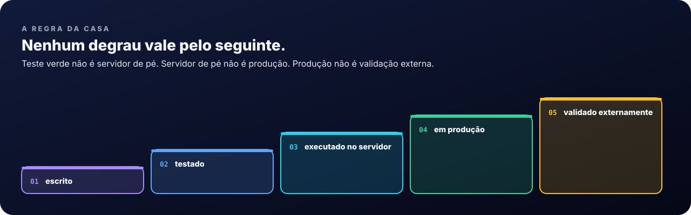

Vale para código, README, proposta e conversa de corredor. Eu prefiro um número menor que aguenta auditoria a um número maior que morre na primeira pergunta — por isso os números da plataforma foram **medidos no repositório em 09/10/2026**, não estimados.

---

## 🧭 Trajetória

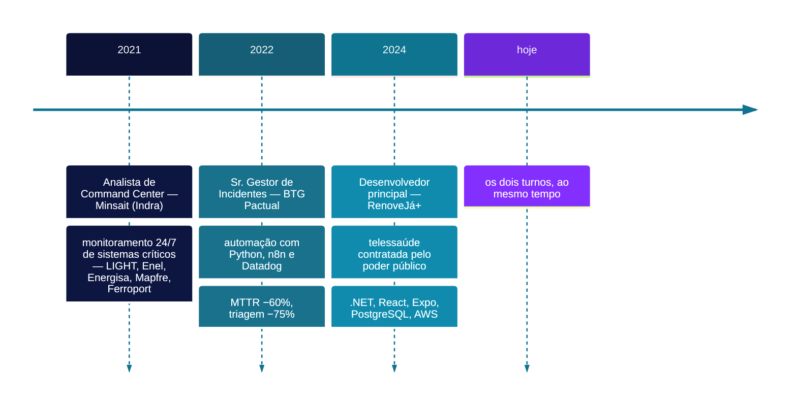

**Formação:** Gestão de Projetos de TI — Universidade Anhembi Morumbi · TCC 9,8/10.

---

<b>🇬🇧 English version</b>

 

**By day** I keep the critical operation of one of Latin America's largest banks running.
**By night** I build the telehealth platform that city governments buy so citizens can be cared for at no cost to them.

Same problem on both sides: **systems that cannot go down — and when they do, real people get hurt.**

- **Night shift — RenoveJá+:** continuous-use prescription renewal, lab orders, telehealth with an AI-assisted chart, a primary-care front desk wired to Brazil's national health ID (CADSUS) and documents signed with the physician's own ICP-Brasil certificate. AI checks and suggests; **the physician always decides and signs.** I'm the lead developer.
- **Day shift — SRE:** P1/P2 incident management at BTG Pactual, automated with Python, n8n and Datadog — MTTR −60%, triage time −75%, 1,000+ tickets a month with OCR + AI, uptime above 99.5%.
- **House rule:** written → tested → running on the server → in production → externally validated. No step stands in for the next one.

The city at the top lives a whole day every 24 seconds. It is pure SVG, drawn in code — no GIF, no video, no JavaScript.

Feito em SVG puro e Markdown — gerado por <code>tools/gerar.mjs</code>.

